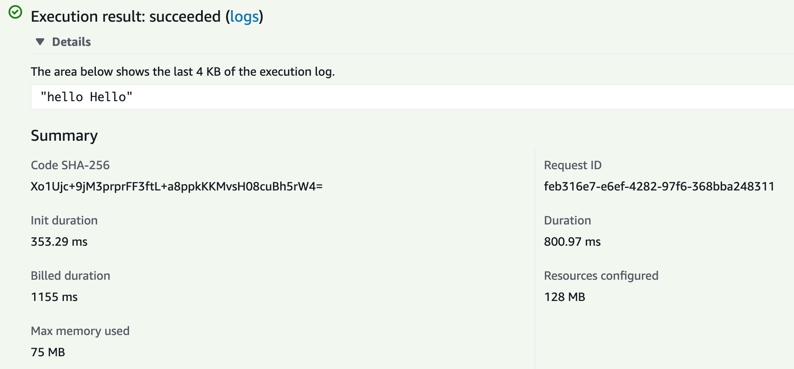
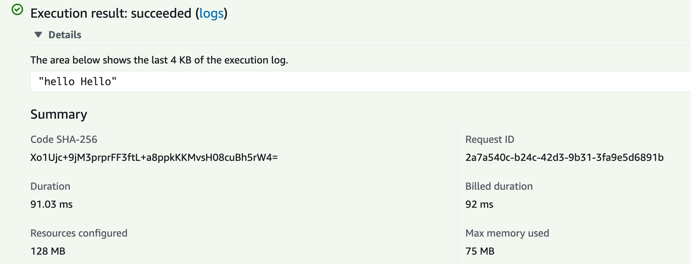

This example consumes this gRPC service https://grpcb.in:9000

### Build

To build the native executable run

```shellScript
quarkus build --native --no-tests -Dquarkus.native.container-build=true
```

Then generated artifact (generated .zip file in target folder) can be used to create an AWS lambda function.

Lambda function configuration

- Runetime: Custom provided bootstrap

### AWS lambda exec results

##### Cold start



##### Warm start


